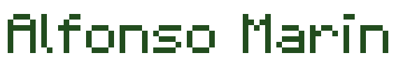
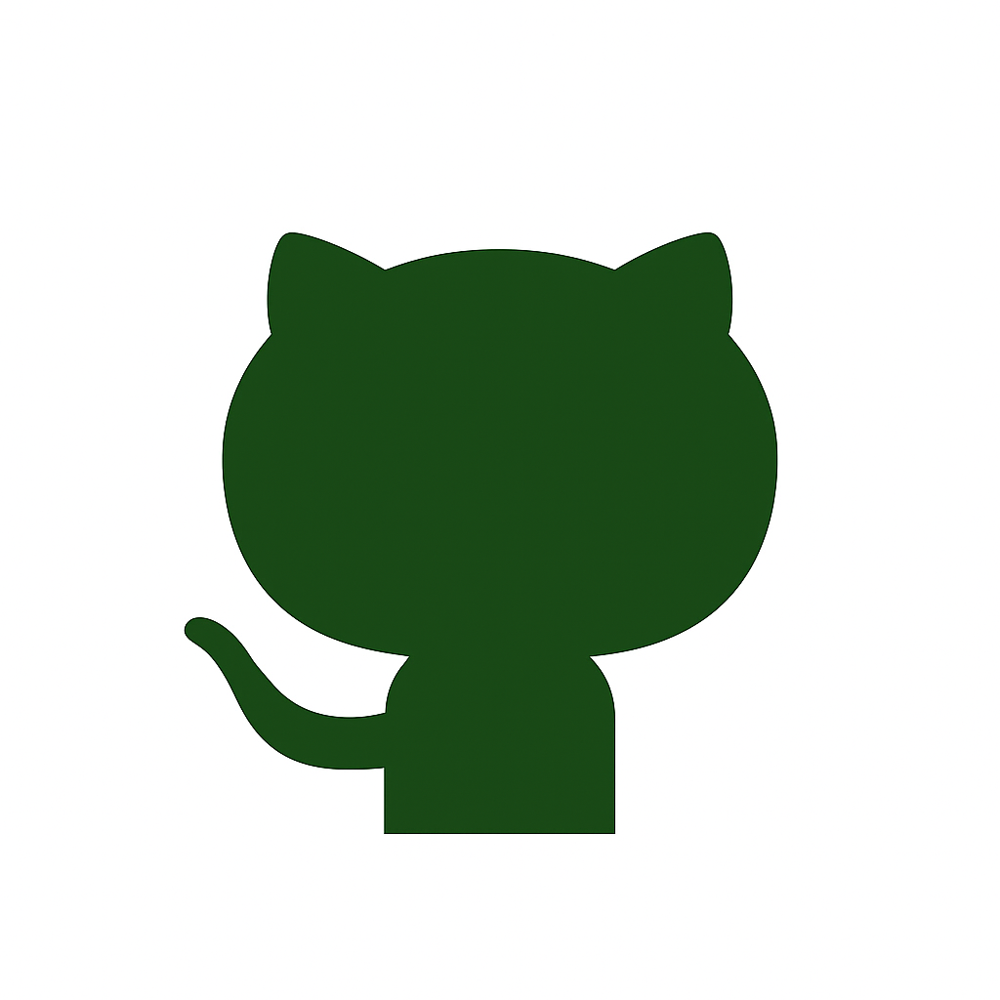

  

  

  
  &#8287;&#8287;&#8287;
  
  &#8287;&#8287;&#8287;
  
  &#8287;&#8287;&#8287;
  
  &#8287;&#8287;&#8287;
  

---

## 📘 Mis proyectos destacados

  <i>✨ Gracias por visitar mi perfil. ¡Explora mis repositorios y proyectos! ✨</i>

